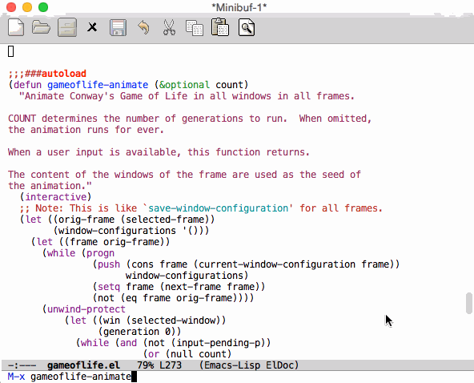

# gameoflife - Screensaver running Conway's Game of Life

*Author:* Anders Lindgren 
*Version:* 0.0.2 
*URL:* [https://github.com/Lindydancer/gameoflife](https://github.com/Lindydancer/gameoflife) 

Run Conway's Game of Life, in all windows, using the original
window content as seed.  In addition, when performing the
animation, the original characters and the colors they have, are
retained, resulting is a much more living result than when simply
using, say, stars.

By "seed", it means that the original content of the windows are
seen as dots in the plane.  All non-blank characters are seen as
live dots.

The Game of Life animation can be started as a screensaver, so that
it starts automatically when Emacs has been idle for a while.  By
default, it stops after 1000 generations.

### Screenshot

## Usage

`gameoflife-animate` -- Start the Game of Life animation.

`gameoflife-screensaver-mode` -- Run as a screensaver.  The
animation is started when Emacs has been idle for a while.

## About Conway's Game of Life

Conway's Game of Life is a simple simulation, originally developed
in 1970, taking place in a two-dimentional grid -- think of it as
an infinite chess board.

A square can either be dead or alive.  In each step in the
simulation, the following rule applies:

- A live square stays alive only if it has two or three neighbours.
- A dead square is resurrected if it has exactly three neighburs.

## Personal reflection

I have noticed that sparse programming languages with a lot of
highlighting, like C and C++, produde the most beautiful
animations.  More dense programming languages, like elisp, tend to
"kill" many squares in the first generation, making them less
suited for Game of Life seeds.

---
Converted from `gameoflife.el` by [*el2markdown*](https://github.com/Lindydancer/el2markdown).
